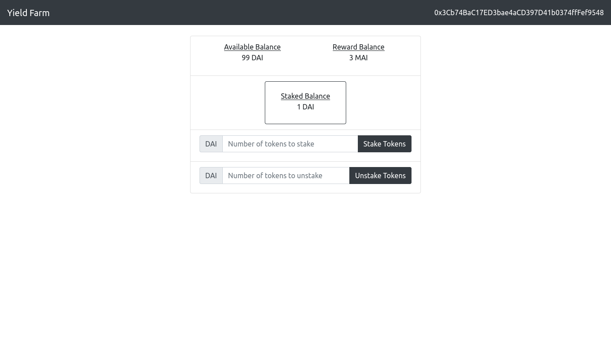
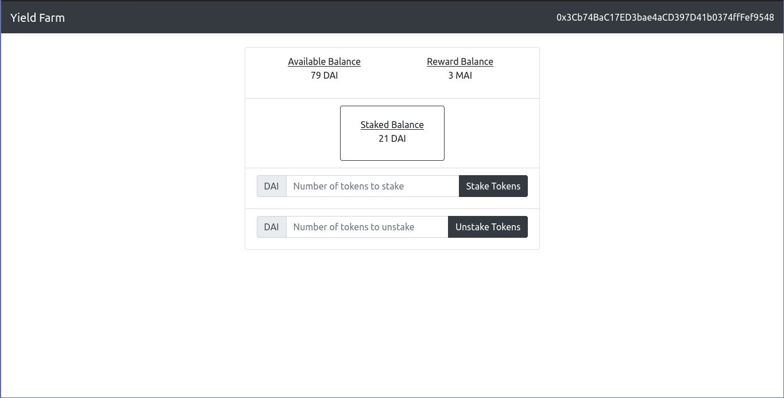
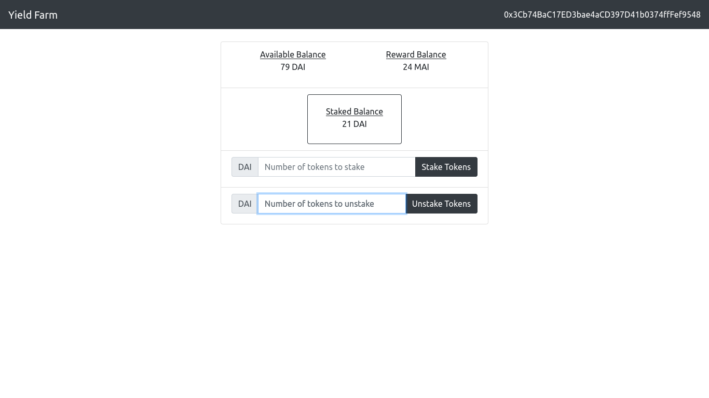
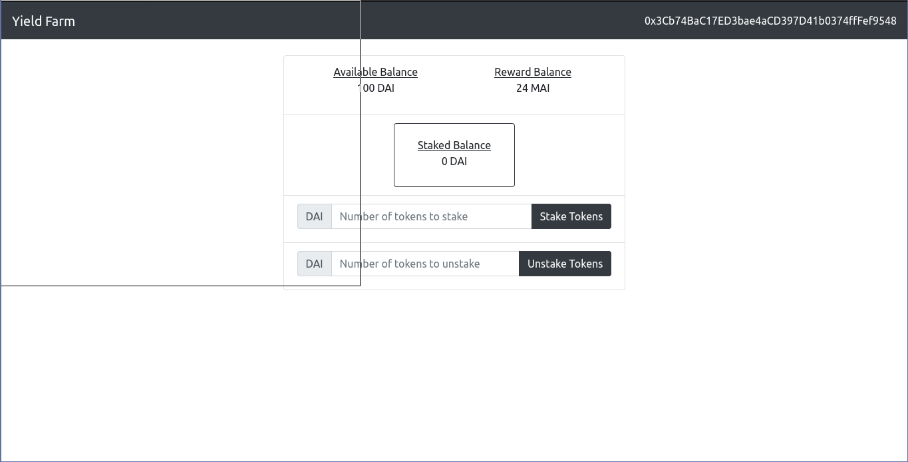

## Simple Defi
---

This is a dapp for yield farming. 

It involves 2 ERC20 tokens:
- DAI Token (DAI)
- My Token (MAI)

---

MAI is out token farm specific token that the investors can earn by staking their DAI.

During the time of token distribution, the investors earn the tokens that they staked in our dApp.

The investors can invest a certain number of DAI Tokens, and unstake specific number of DAI tokens at any point of time.

The script for MAI token issuance can be run by the owner only. At specific times, the owner runs the script, and all the stakers get the same amount of MAI as the number of DAI staked.

---

Tested using local blockchain at port 8585 (Ganache)

Load the second account in the ganache to metamask. In the script for deployment, the second account gets 100 DAI.

I played around with it before. So, the staked, reward and available balance are not equal to 0 DAI,0 MAI and 100 DAI.



Staking 20 DAI:

You need to confirm transaction via metamask.

Run the script to reward stakers. 
```sh
truffle exec scripts/issue-mytokens.js
```
Refresh the page. Now, the staker will get MAI equal to staked balance as reward.
Previously, the staker had 3 MAI as reward and 1 DAI as staked balance.
When 20 DAI is staked, total staked balance is 21 DAI.
Now, when the reward is issued, staker gets 21 MAI as reward, and thus has (21+3) = 24 MAI now.



Now, let's unstake all 21 DAI and and try to reward the stakers. Metamask transaction needs to be confirmed.


Now, run the script to reward stakers. Since the staked balance is 0, this address won't get any more MAI. 
